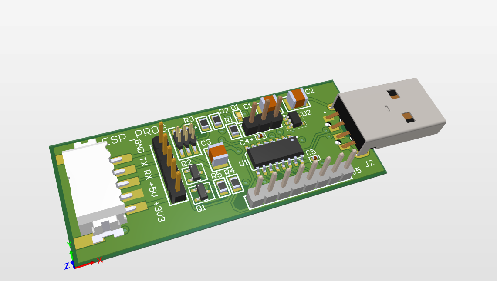

# PCB Design: [CH340C-USB-SERIAL]

## Overview
This is a USB <-> UART Converter that uses Ch340C chip. This chip can work on Both 5V and 3.3V. This board is designed to use as a USB-UART converter and ESP-32 Programmar that will upload ESP32 Codes with UART bootloader via the ESP-PROG style connector. 

## Schematic
[Download The Schematic](./Docs/schematics.pdf)  

## 3D View
  
*Frontside render of the PCB design.*

  
*Backside 3D render of the PCB design.*

## PCB Layout
  
*Combined Layer of PCB.*

  
*FrontSide of PCB.*

  
*Bottom Layer of PCB.*
