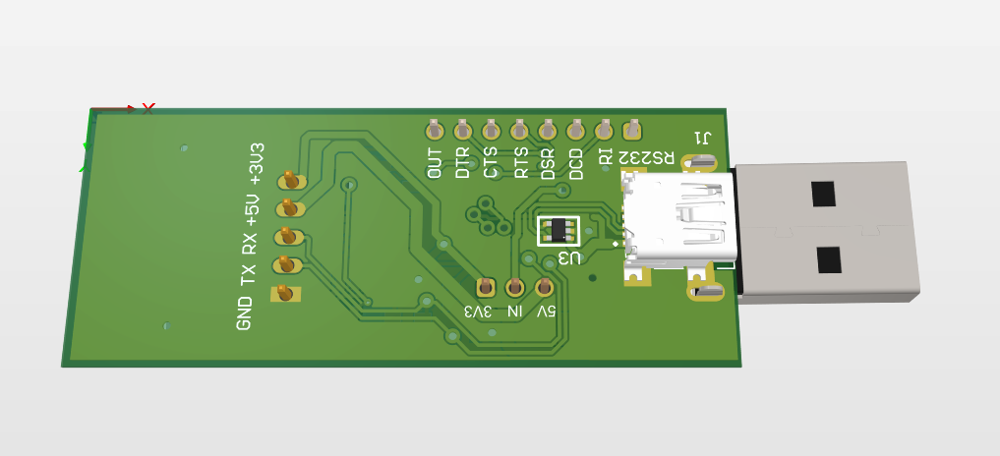

# PCB Design: [ESP32-with-USB]

## Overview
This is a modified Dev board of ESP32-S3-Mini. This board was done for learning purpose. It has used a FTDI chip insted of typical chxx chips
## Features
- **Design Type**: [Single/Double/Multilayer PCB]
- **Microcontroller/IC**: [Name of the MCU/IC used]
- **Power Supply**: [Input voltage range, e.g., 5V, 12V, etc.]
- **Board Dimensions**: [e.g., 50mm x 70mm]
- **Additional Components**: [Any important sensors, modules, or other ICs used]

## Schematic
[Download The Schematic](./Docs/ESP32-with-USB.pdf)  

## 3D View
  
*Frontside render of the PCB design.*

  
*Backside 3D render of the PCB design.*

## PCB Layout
  
*Combined Layer of PCB.*

  
*FrontSide of PCB.*

  
*Bottom Layer of PCB.*
