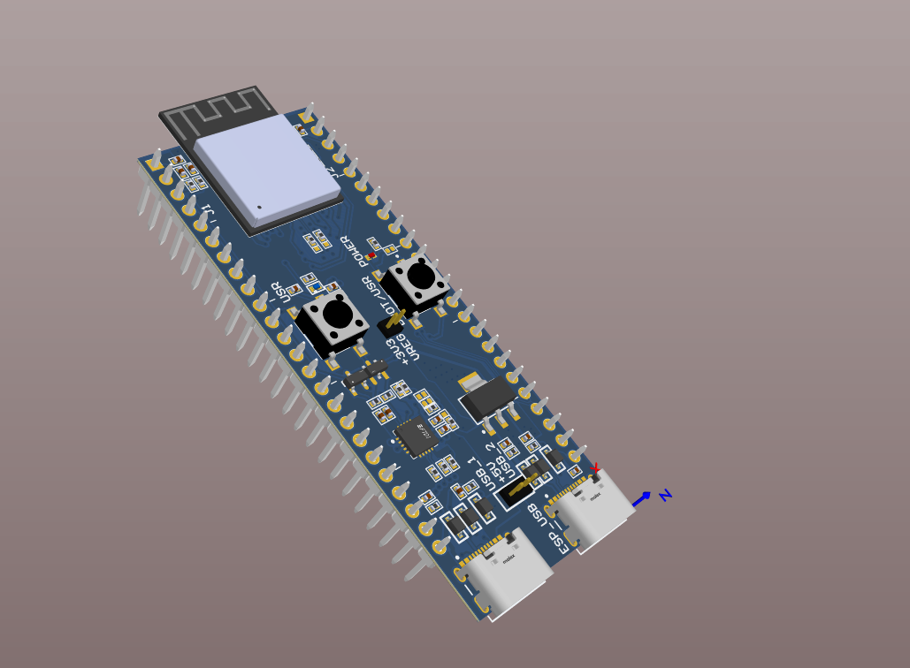
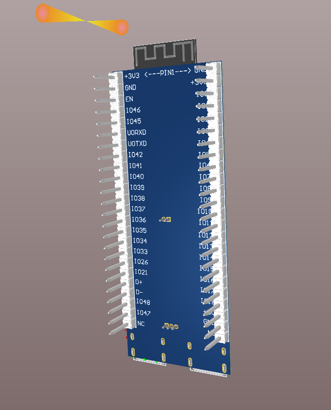
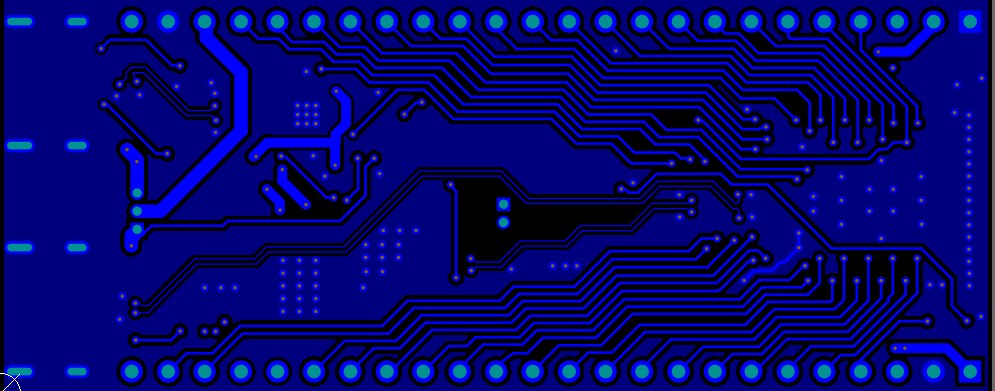

# PCB Design: [ESP32-with-USB]

## Overview
This is a modified Dev board of ESP32-S3-Mini. This board was done for learning purpose. It has used a FTDI chip insted of typical chxx chips

## Schematic
[Download The Schematic](./Docs/ESP32-with-USB.pdf)  

## 3D View
  
*Frontside render of the PCB design.*

  
*Backside 3D render of the PCB design.*

## PCB Layout
  
*FrontSide of PCB.*

  
*Bottom Layer of PCB.*

