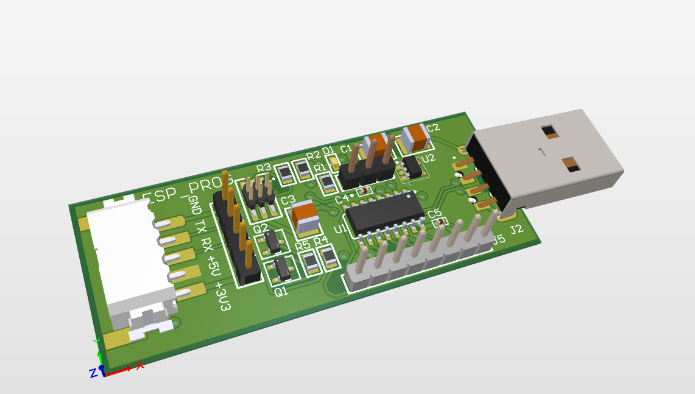
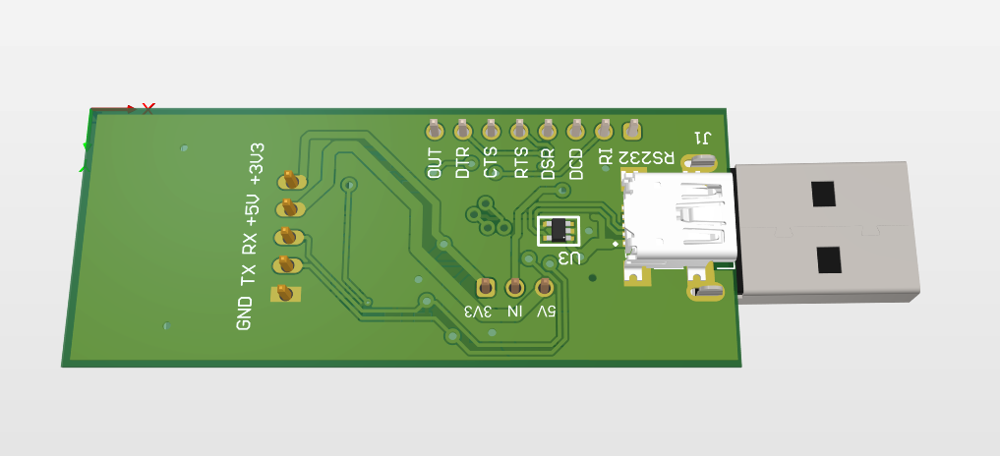

# PCB-DESIGNS

## [ ESP32-S3 Mini Custom Dev Board](./ESP32-with-USB)

|  | |
|:-----------------------------------:|:-----------------------------------:|
| TOP 3d View                 | BOTTOM 3d View                 |

## [CH340C USB-UART converter](./CH340-USB-SERIAL)

|  | |
|:-----------------------------------:|:-----------------------------------:|
| TOP 3d View                 | BOTTOM 3d View                 |
